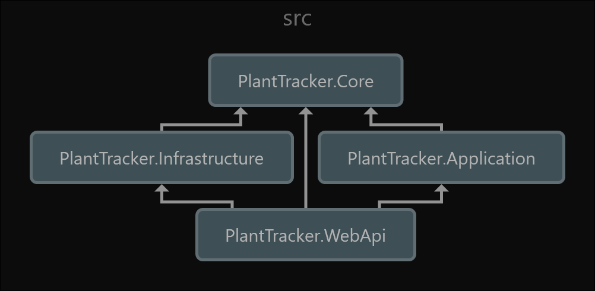

# dotnet-api-clean-architecture

The purpose of this repo is to provide an example of an API written using a simplified version of the Clean Architecture design principle in .NET. 
The PlantTracker Web API allows a user to keep a record of plants by tracking their name, scientific name, usda website url, age, and duration in a DynamoDB database.

## Overview

The code is constructed using Clean Architecture design principle which allows for seperation of concerns and framework independence. The solution contains four main layers which are represented by the .Net Projects: PlantTracker.WebApi, PlantTracker.Core, PlantTracker.Applicaiton, PlantTracker.Infrastructure. The layers allow for the buiness locgic to be independent from the infrastructure so that any individual layer may be replaced without to refactor the entire repository. Dpendencies between layers are minimized by utilizing the Core layer. If the Application layer needs to call a service in the Infrastructure layer, it would accomplish this by dependency injection using an interface from the Core Layer.

Although this design principle may contain more code then other APIs designs, its written for long term maintainability so that code can be removed and replaced without causing major refactors or complete rewrites.

#### Project Layers
| Layer Name | Project Name | Description |
|---------|-----------|----------|
| Applicaiton | PlantTracker.Application.csproj | The Application layer contains the business logic of the applicaiton and should only depend on the Core layer. |
| Core | PlantTracker.Core.csproj | [Repository](https://github.com/user/repo) | The Core layer contains all interfaces and models shared across all layers. |
| Infrastructure | PlantTracker.Infrastructure.csproj | The Infrastructure layer contains implementations to external systems the application relies on like databases, API's, caches, etc. |
| WebApi | PlantTracker.WebApi.csproj | The API layer is exposed to the consumer. This layer should contain controllers, middleware (auth, error handling), dependency injection, and project initialazation. |

### Project Structure and Dependencies

#### Project Structure Overview
This high level folder sturcture of the solution shows the code is seperated into two main folders src and test. Supporting directories include docker, data, and scripts.

```
dotnet-api-clean-architecture/
├── .github/
├── data/
├── docker/
├── scripts/
├── src/
│   ├── PlantTracker.Application.csproj/ 
│   │   ├── Services/
│   │   └── DependencyInjection/
│   ├── PlantTracker.Core.csproj/
│   │   ├── Constants/
│   │   ├── Exceptions/
│   │   ├── Interfaces/
│   │   ├── Models/
│   │   └── Validations/
│   ├── PlantTracker.Infrasturcture.csproj/
│   │   ├── Configurations/
│   │   ├── Converters/
│   │   ├── DependencyInjection/
│   │   ├── Models/
│   │   └── Repositories/
│   ├── PlantTracker.WebApi.csproj/
│   │   ├── Controllers/
│   │   ├── Middleware/
│   │   |   └── Identity/
│   │   └── Program.cs
├── tests/
│   ├── PlantTracker.Application.UnitTests.csproj/
│   ├── PlantTracker.Core.UnitTests.csproj/
│   ├── PlantTracker.Infrasturcture.UnitTests.csproj/
│   └── PlantTracker.WebApi.UnitTests.csproj/
├── .gitignore
├── docker-compose.yml
└── README.md
```

#### Project Dependency Diagram

 This graph shows the dependencies between the main source projects. Note that all projects depend on the Core layer. The WebApi layer depends on all layers only for dependency injection purposes.
 
 

## PlantTracker Web Api

The PlantTracker Web Api provides CRUD operations for a plant table in DynamoDB. Authentication and Auorization is enabled using JWT tokens. A Global Error Handler returns a Problem Details object to prevent exposure of internal informaiton or stack traces.

### API Endpoints

The table below contains the API endpoints that have been made available. Endpoints are also documentation in OpenApi in the PlantTracker.WebApi.json file. When running the API, Scalar is also available for use.

| Method | Endpoint | Description | Authentication Required | Authorization Admin Role Required |
|--------|----------------|----------------|-----|----|
| GET    | `/plant/users` | Get all plants | ✅ | ❌ |
| GET    | `/plant/{id}`  | Get plant      | ✅ | ❌ |
| PUT    | `/plant`       | Create plant   | ✅ | ✅ |
| PATCH  | `/plant/{id}`  | Update plant   | ✅ | ✅ |
| DELETE | `/plant/{id}`  | Delete user    | ✅ | ✅ |


### Plant Table

| Column | Data Type | Description | Required |
|--------|----------------|----------------|---- |
| Id                    | `string`          | Id of the plant. Value must be a Guid.             | ✅ |
| CommonName            | `string`          | Common Name of the plant.                          | ✅ |
| ScientificName        | `string`          | Scienific Name of the plant.                       | ✅ |
| Age                   | `int`             | Age of plant in years.                             | ✅ |
| Duration              | `string`          | Duration of plant (i.e. Annual, Perennial, Unknown)| ✅ |
| CreatedDateUtc        | `DateTimeOffset`  | Created Date and time of the record in UTC         | ✅ |
| ModifiedDateUtc       | `DateTimeOffset`  | Modified Date and time of the record in UTC        | ✅ |

### Authentication

This API uses JWT Authentication. To generate a jwt token for this API, please reference and use the [dotnet-api-identity](https://github.com/ckonkol1/dotnet-api-identity) API.

## Local Development
